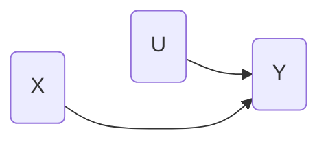
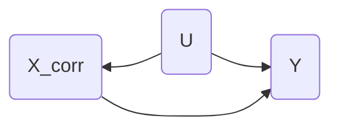

### Applied Data Analytics

<br/>

# Pandas basics

### Simulating data

<br/>

Hans-Martin von Gaudecker and Aapo Stenhammar

---


---

# Simulating data

- Monte Carlo studies because of randomness

- Will see mathematical basis only in statistics course

- Just work with intuition & recipe here

---

# Simulating data

- Called <span style="color:#CD7F32;">Monte Carlo</span> studies because of randomness

- Will see mathematical basis only in statistics course

- Just work with intuition & recipe here

---

# Recipe for simulating a series

<div class="grid grid-cols-5 gap-24">
<div class="col-span-3">

```python
rng = np.random.default_rng(seed=243345)

samples = pd.Series(
  rng.normal(loc=10, scale=5, size=10),
  name="u"
)

print(samples)
```
<br/>

</div>
<div class="col-span-2">

|    |        u |
|---:|---------:|
|  0 |  8.32006 |
|  1 | 13.5407  |
|  2 | 18.185   |
|  3 |  2.93449 |
|  4 |  9.22757 |
|  5 | 17.8104  |
|  6 | 12.8181  |
|  7 | 10.3423  |
|  8 |  9.85138 |
|  9 | 12.4335  |

</div>
</div>

---

# OLS, happy path





---

# OLS, happy path

<div class="grid grid-cols-5 gap-24">
<div class="col-span-2">

<br/>
<br/>

$$
\begin{aligned}
% Y_i &= \beta_0 + \beta_1 X_i + U_i \\[5ex]
X_i & \sim \text{Normal}(10, 5) \\[2ex]
U_i & \sim \text{Normal}(0, 15) \\[5ex]
Y_i &= 5 + 2 \cdot X_i + U_i
\end{aligned}
$$

</div>
<div class="col-span-3">

```python
size = 100


data = pd.DataFrame({
    "x": rng.normal(loc=10, scale=5, size=size),
    "u": rng.normal(loc=0, scale=15, size=size),
})


data["y"] = 5 + 2 * data["x"] + data["u"]
```

</div>
</div>


---


---


---

# OLS, with confounder



---

# OLS, with confounder

<div class="grid grid-cols-3 gap-18">
<div class="col-span-1">

<br/>
<br/>

$$
\begin{aligned}
X^\text{corr}_i & = X_i + U_i / 3 \\[4ex]
Y^\text{corr}_i &= 5 + 2 \cdot X^\text{corr}_i + U_i
\end{aligned}
$$

</div>
<div class="col-span-2">

```python
data_corr = data.copy()


data_corr["x"] = data_corr["x"] - data_corr["u"] / 3


data_corr["y"] = 5 + 2 * data_corr["x"] + data_corr["u"]

```

</div>
</div>


---


---


