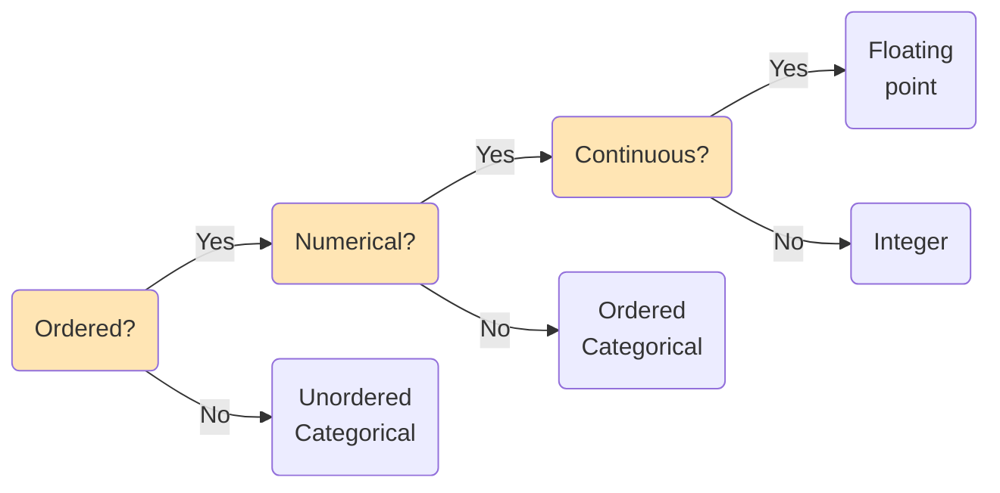

# Decision tree

```mermaid {theme: 'neutral', scale: 0.75, htmlLabels: false}
flowchart LR
    A -->|"`Yes`"| C("`Numerical?`")
    A(Ordered?) -->|No| B("`Unordered
    Categorical`")

    C -->|"`Yes`"| E("`Continuous?`")
    C -->|"`No`"| D("`Ordered
    Categorical`")

    E -->|"`Yes`"| G("`Floating
    point`")
    E -->|"`No`"| F("`Integer`")

    style A fill:#FFE5B4
    style C fill:#FFE5B4
    style E fill:#FFE5B4
```

 
 
 
