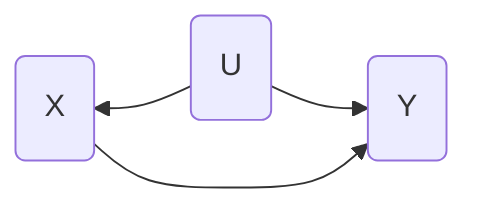

### Applied Data Analytics

 

# Data analysis — Interpretation challenges

### Graphs & Causality

 

Hans-Martin von Gaudecker and Aapo Stenhammar

---

# Graphs & Causality

- Graphs encode sense of direction

- Data description alone **never** does

---

# Inferring causality

- Necessary condition: We have a DAG

  _Implies that framework is not immediately constructive for supply and demand_

   

- No forks on any path from cause to effect ("no confounders")

 
 

---

# Inferring causality

- Necessary condition: We have a DAG

  _Implies that framework is not immediately constructive for supply and demand_

   

- No forks on any path from cause to effect ("no confounders")

  _Could in principle solve via including all confounders in a multiple regression_

  $$Y_i = \beta_0 + \beta_1 X_{1, i} + \beta_2 X_{2_i} + \ldots + \beta_k X_{k_i} + U_i$$

  _but the world is too complex for that._

 
 
 
