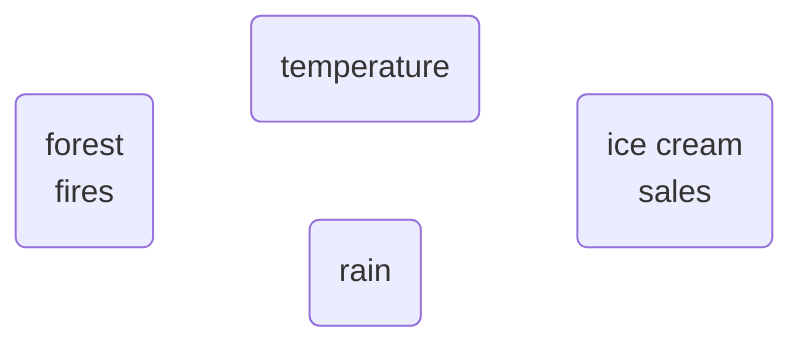
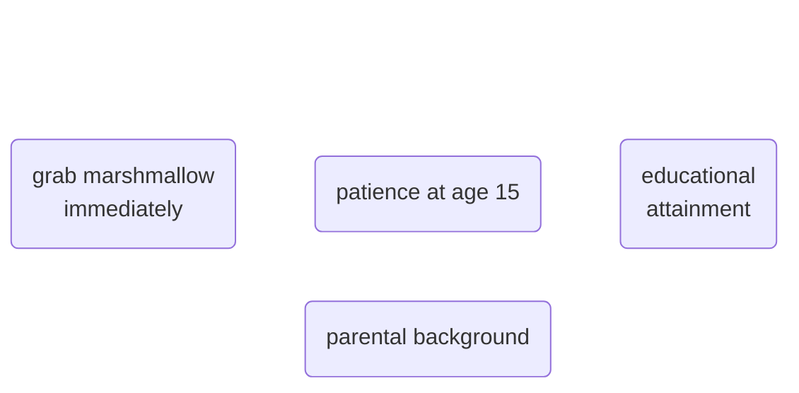
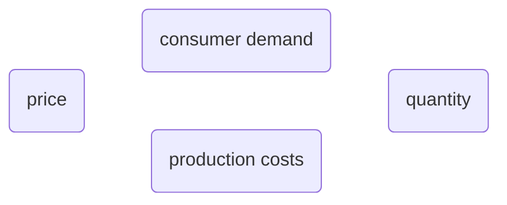
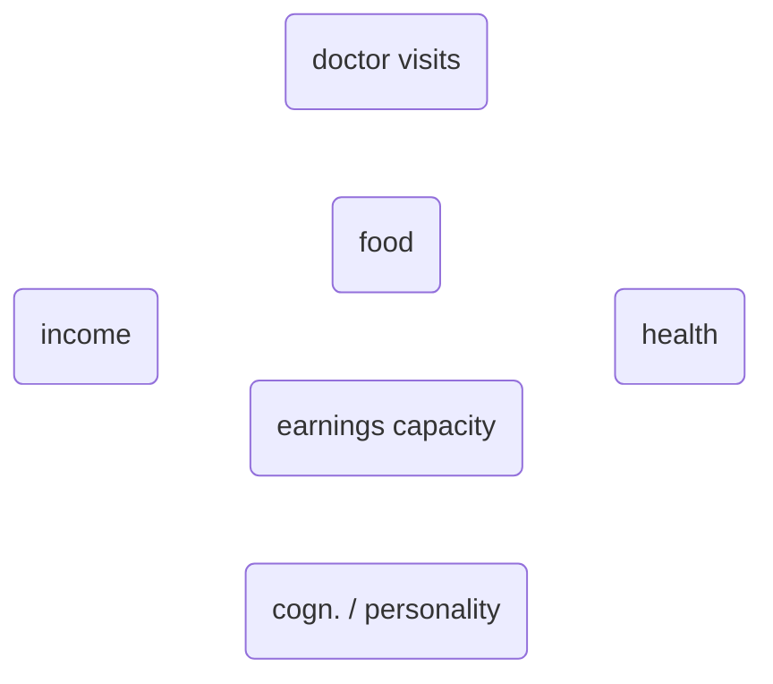
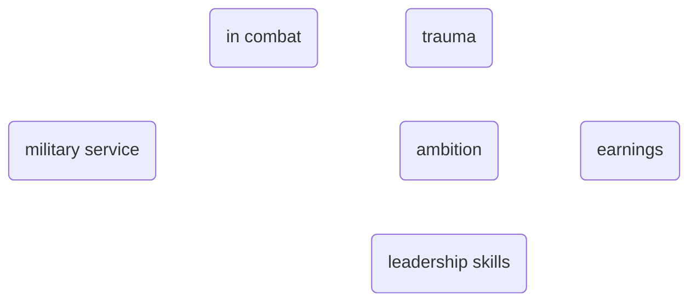

### Applied Data Analytics

 

# Data analysis — Interpretation challenges

### Using graphs for modelling

 

Hans-Martin von Gaudecker and Aapo Stenhammar

---

# Forest fires and ice cream sales

 
 

---

# Marshmallows and education

---

# Supply and demand

 
 

 

---

# Income and health

---

# Military service and earnings

---

# Steps to structure models

1. Start from a large model with many variables.

2. Only then remove paths based on arguments about how the world works (theory!)

Missing paths are restrictions!
