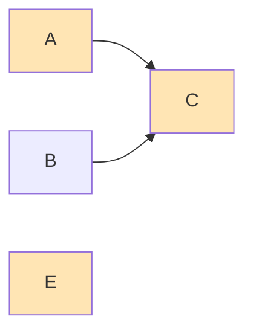

### Applied Data Analytics

 

# Data analysis — Interpretation challenges

### Using graphs for modelling

 

Hans-Martin von Gaudecker and Aapo Stenhammar

---

```mermaid {theme: 'neutral', scale: 0.75, htmlLabels: false}
flowchart LR
    A --> C
    B --> C

    style A fill:#FFE5B4
    style C fill:#FFE5B4
    style E fill:#FFE5B4
```

 
 
 
