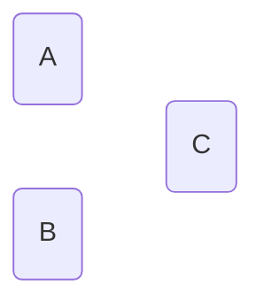
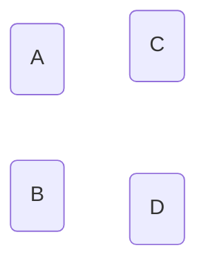

### Applied Data Analytics

 

# Data analysis — Interpretation challenges

### Basic graph terminology

 

Hans-Martin von Gaudecker and Aapo Stenhammar

---

# Nodes

 

 
 

---

# Graph = (Nodes, edges)

 

 
 

---

# Undirected Graph = (Nodes, edges)

 

 
 

---

# Directed Graph = (Nodes, edges)

 

 
 

---

# Directed Acyclic Graph (DAG)

 

 
 

---

# Directed Acyclic Graph (DAG)

 

 
 
