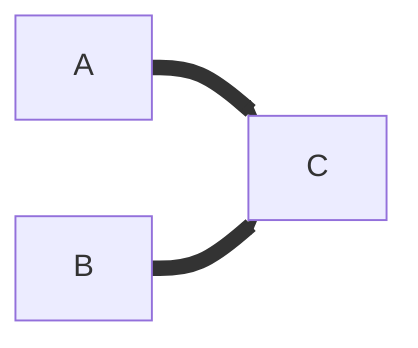

### Applied Data Analytics

<br/>

# Data analysis — Interpretation challenges

### Basic graph terminology

<br/>


Hans-Martin von Gaudecker and Aapo Stenhammar

---

# Nodes

<br/>

```mermaid {theme: 'neutral', scale: 0.75, htmlLabels: false}
flowchart LR
    A[Start] -- B{Decision}
    B -- C[Result 1]
    B -- D[Result 2]
    C -- E[End]
    D -- E
```

<br/>
<br/>

---

# Nodes, undirected edges



<br/>
<br/>
<br/>
