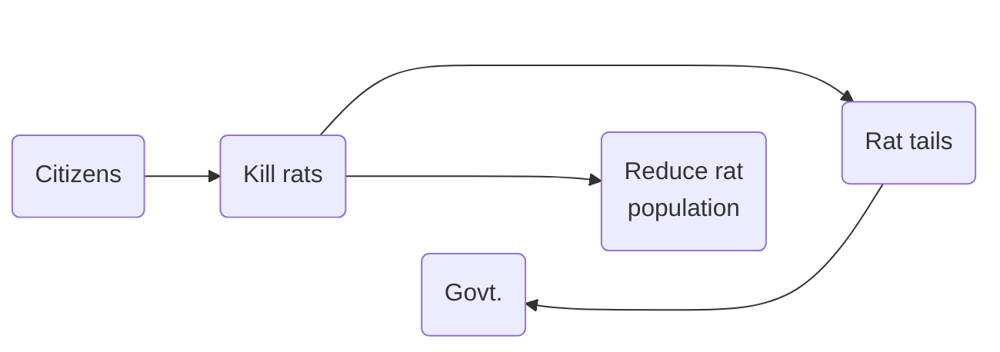
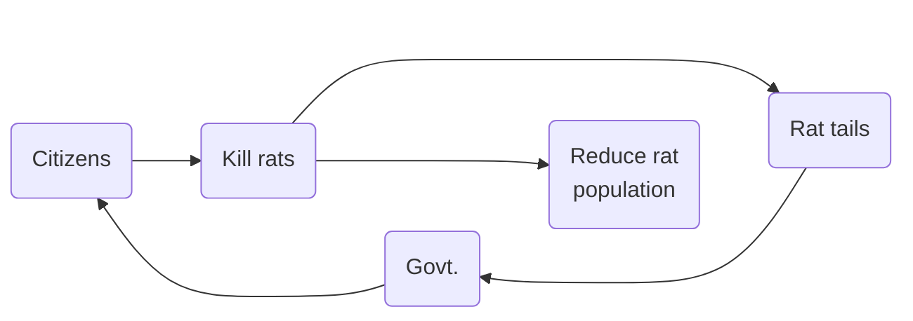
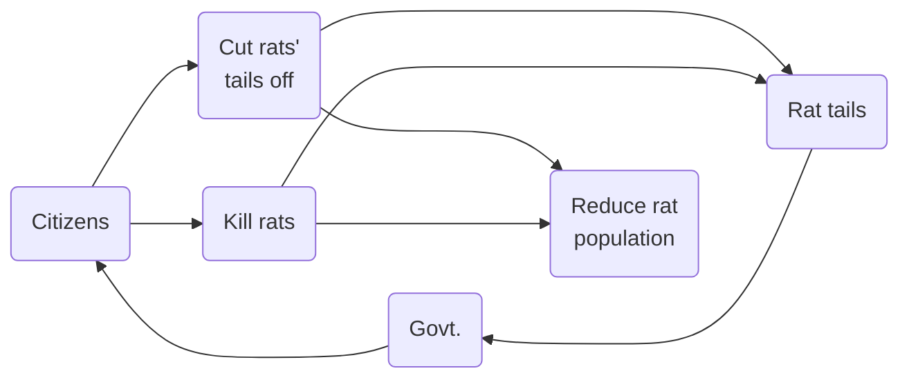
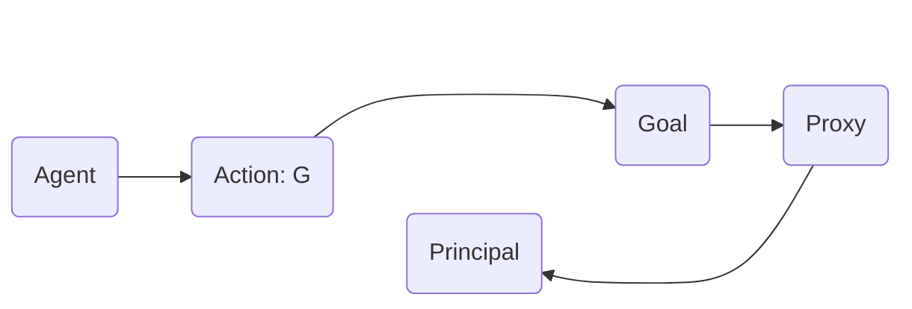
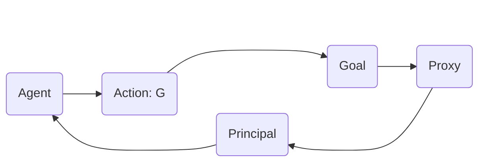
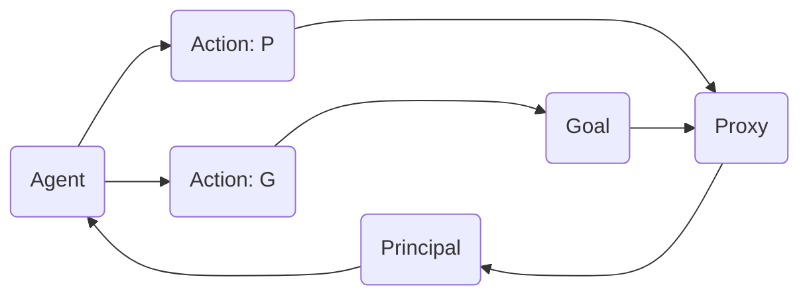
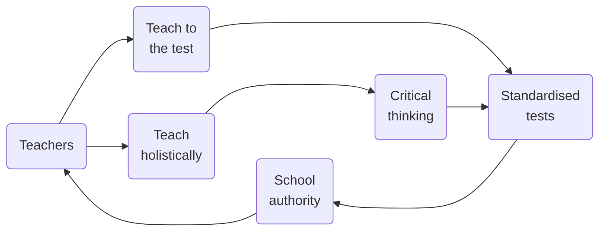
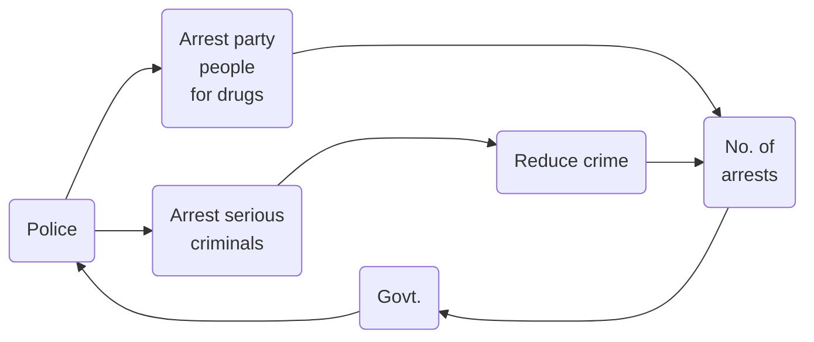
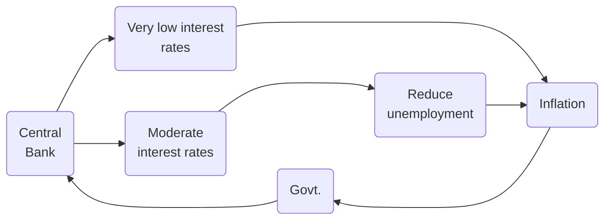
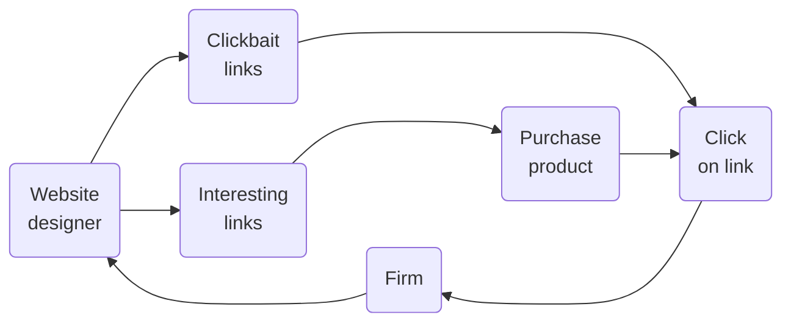

### Applied Data Analytics

 

# Data analysis — Interpretation challenges

### Proxy failure

 

Hans-Martin von Gaudecker and Aapo Stenhammar

---

# [Rats (Hanoi, 1902)](https://en.wikipedia.org/wiki/Great_Hanoi_Rat_Massacre)

- Needed to reduce rat population

- Wanted to provide incentives for killing rats

- Payment upon delivering rat tail

---

# The world before the incentive scheme

---

# The world with the incentive scheme

---

# The world with the incentive scheme

---

# Goodhart's law

In the formulation by Marilyn Strathern:

 

_When a measure becomes a target, it ceases to be a good measure._

 

Causal model for how the world works changes when we let agents act upon it.

---

# Principal observes

---

# Principal incentivises proxy measure

---

# Principal incentivises proxy measure

---

# Education

---

# Policing

---

# Phillips curve

---

# Clicks

---

# Bottom line

- Quantification is important

- Measurement is important

- But beware when applying it to control complex systems!

  _Ideas of one principal vs. creativity of many agents!_
