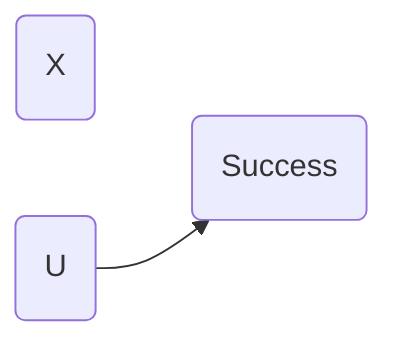
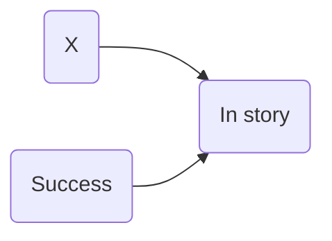
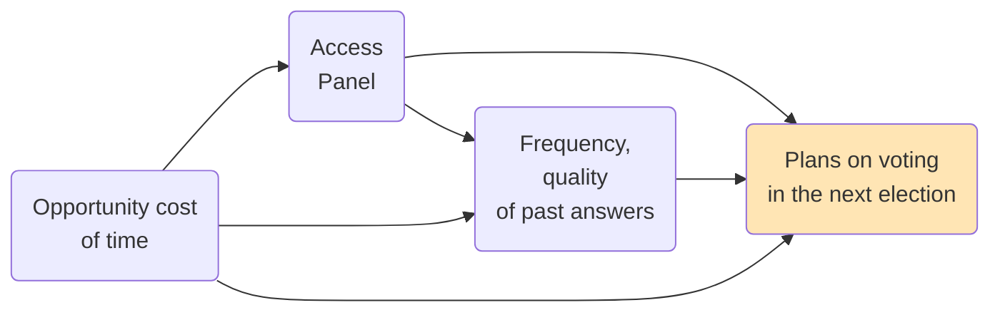
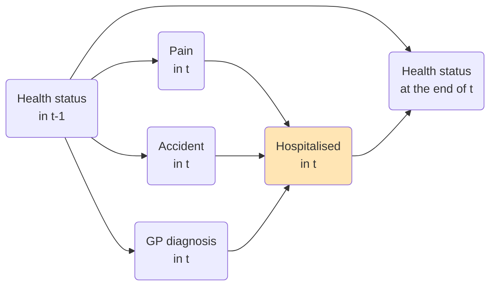

### Applied Data Analytics

 

# Data analysis — Interpretation challenges

### Selection models

 

Hans-Martin von Gaudecker and Aapo Stenhammar

---

# Examples

- Learning from successful founders (case studies, any retrospective study)

- Polling people who spend lots of time answering polls

- Comparing health outcomes of hospitalised and non-hospitalised to learn about the
  effect of hospitalisation

---

# Learning from successful founders?

Typical article about founders:

1. Interview successful founders ($Y$)

2. Narrow down the narrative to 1-2 factors ($X$)

Example based on
[Mollick blog](https://www.oneusefulthing.org/p/when-survivorship-bias-meets-superstitious),
[Lifchits et al. (2023)](https://doi.org/10.1017/S1930297500008494)

---

# Learning from successful founders?

Causal relation between $X$ and $Y$

Selection model

 
 

---

|  $Y$ | $X$ | $Y$ condition | $X$ condition | In story |
| ---: | --: | ------------- | ------------- | -------- |
| 1000 | 500 | True          | True          | True     |
|  900 | 400 | True          | True          | True     |
|  800 | 300 | True          | True          | True     |
|  700 | 200 | True          | False         | False    |
|  600 | 100 | True          | False         | False    |
|  500 | 100 | False         | False         | False    |
|  400 | 200 | False         | False         | False    |
|  300 | 300 | False         | True          | False    |
|  200 | 400 | False         | True          | False    |
|  100 | 500 | False         | True          | False    |

---

# Published story

All successful founders have exceptionally high values of $X$ and more is better. Here
is the table to prove it:

 

|  $Y$ | $X$ |
| ---: | --: |
| 1000 | 500 |
|  900 | 400 |
|  800 | 300 |

---

# Polling people in access panels

 
 

---

# Health effects of hospitalisation

 
 
