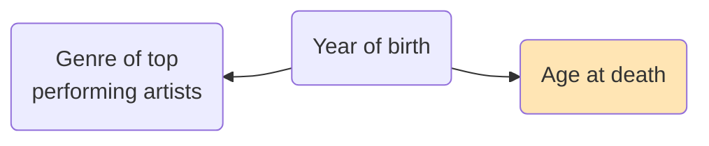

### Applied Data Analytics

 

# Data analysis — Interpretation challenges

### One-sided selection

 

Hans-Martin von Gaudecker and Aapo Stenhammar

---

# Possible goals

- Describe distribution of $Y$ and/or $X$

- Describe relation between $X$ and $Y$ (correlation, CMF $\bar{Y}|X$, ...)

# Problem

- Data on $X$ and/or $Y$ is missing for some reason

# Examples

- Not clear what salary expectation of 15k € annually meant

- Most hip hop musicians are still alive

---

# When is this a problem?

 

---

# Distribution of birth years

---

# Using observed age at death

- Calculated mean age at death < true mean age at death

  *Many artists are still alive, so it can only go up.*

- Wrong result for relation between genre and age at death

  *Distribution of birth years not the same for all genres.*

---

# One-sided selection: Summary

- Interested in describing (joint) distributions

- Data is missing on $X$ and/or $Y$

- Why is it missing?

  - Purely at random? E.g., because of proper sampling?

    Typically fine to ignore.

  - Else: Think hard about the causal selection process

    Obvious bias in some direction?
