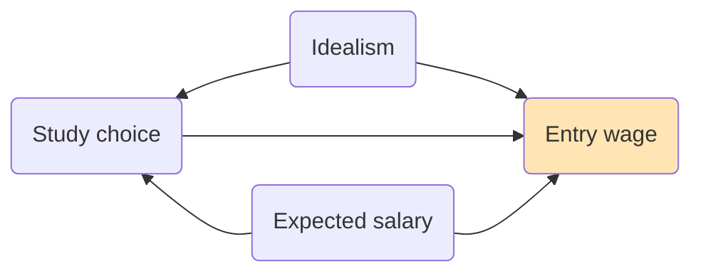

### Applied Data Analytics

 

# Data analysis — Interpretation challenges

### Two-sided selection

 

Hans-Martin von Gaudecker and Aapo Stenhammar

---

# Causality as a two-sided selection problem

- Interested in the effect of study choice on entry wages

- $X_i$: Study economics or business administration

- $Y_i$: Entry wage

---

# Outcomes

|         | Choice: Econ | Choice: Bus admin | $Y_i$ │ Econ | $Y_i$ │ Bus admin |
| ------- | -----------: | ----------------: | -----------: | ----------------: |
| Alice   |        False |              True |            . |            53,000 |
| Bob     |         True |             False |       52,000 |                 . |
| Charlie |        False |              True |            . |            45,000 |
| Derek   |        False |              True |            . |            67,000 |

---

# Potential outcomes = Counterfactuals

|         | Choice: Econ | Choice: Bus admin | $Y_i$ │ Econ | $Y_i$ │ Bus admin |
| ------- | -----------: | ----------------: | -----------: | ----------------: |
| Alice   |        False |              True |            ? |            53,000 |
| Bob     |         True |             False |       52,000 |                 ? |
| Charlie |        False |              True |            ? |            45,000 |
| Derek   |        False |              True |            ? |            67,000 |

---

# Comparing means

|                           | Choice: Econ | Choice: Bus admin |
| ------------------------- | -----------: | ----------------: |
| **$\bar{Y}$ │ Econ**      |       52,000 |                 . |
| **$\bar{Y}$ │ Bus admin** |            . |            55,000 |

Why don't we observe the two missing values?

Model of selection into type of study!

---

# Selection model

 

---

# Selection model

$$
\begin{align*}
Y_i & = \alpha + \beta \text{Bus admin}_i + U_{i}\\[2ex]
\bar{Y} | \text{Econ} & = \alpha \quad\;\;\; + \bar{U} | \text{Econ} \\[2ex]
\bar{Y} | \text{Bus admin} & = \alpha + \beta +  \bar{U} | \text{Bus admin}
\end{align*}
$$

**No contradiction:**

$\bar{Y} | \text{Econ} < \bar{Y} | \text{Bus admin} \qquad$ **and** $\qquad\beta < 0$

---

# Consequences

- We can never observe the causal effect at the individual level

  **Always need some reduction operation**

- Comparing means only makes sense if selection is random, i.e.

  $$\bar{U} | \text{Econ} = \bar{U} | \text{Bus admin} = 0$$

- When thinking about causal effects, always define the population of interest

  - All people who study economics? Economics or business administration?

  - All people with Abitur?

  - All people born in 2005?
